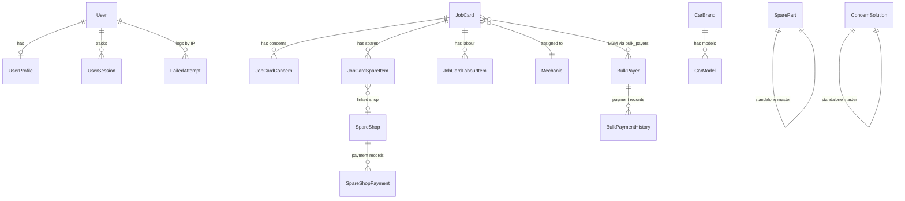
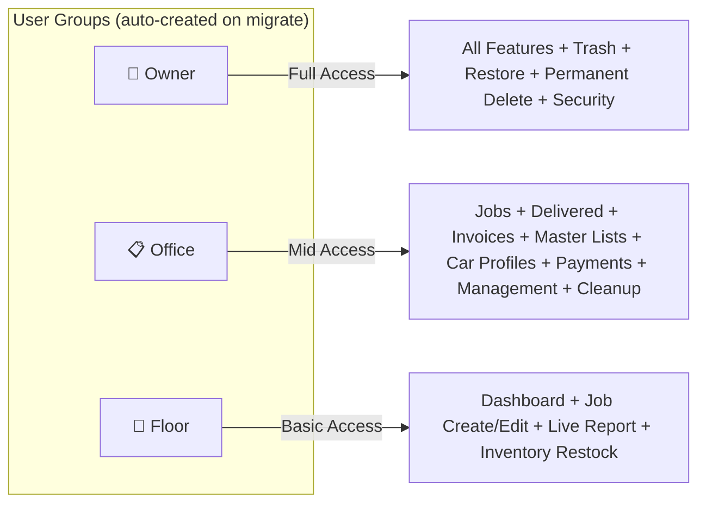
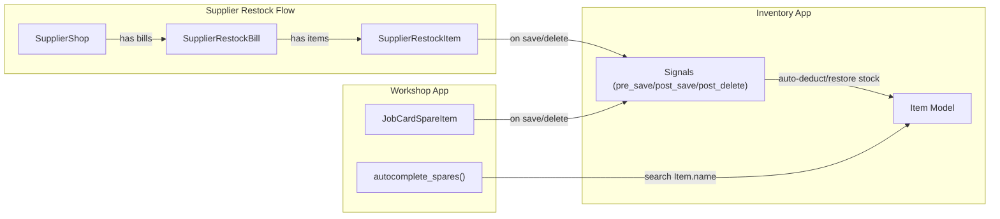
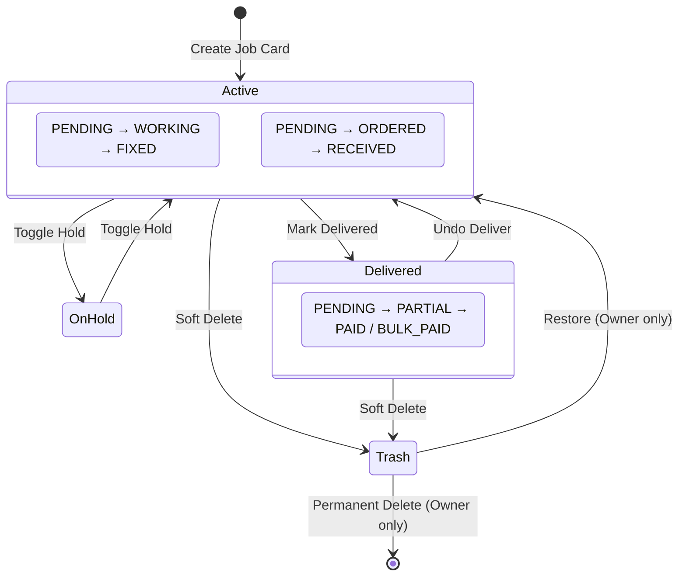
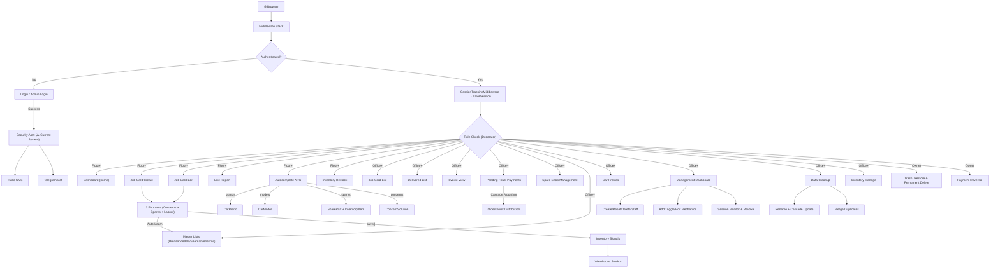

# 🏗️ WorkshopOS (Titan) — SUPER MASTER BLUEPRINT

> **Project**: Formula-D Workshop Management System  
> **Framework**: Django 5.2 LTS · Python 3.13 · SQLite (dev) · PostgreSQL (🔜 production)  
> **Apps**: `workshop` (core) + `inventory` (warehouse)

---

## 1. HIGH-LEVEL ARCHITECTURE

```mermaid
graph TB
    subgraph DJANGO["Django Project: formulad_workshop"]
        SETTINGS["settings/ (base, dev, prod)"]
        ROOT_URLS["Root urls.py"]
    end

    subgraph WORKSHOP["Workshop App (Core)"]
        W_MODELS["models.py — 16 Models"]
        W_VIEWS["views/ — 12 Module Package"]
        W_AUTH["auth_views.py — 6 Auth Views"]
        W_MGMT["management_views.py — 5 Management Views"]
        W_CASH["cashbook_views.py — 4 Cashbook Views"]
        W_CLEAN["cleanup_views.py — 5 Views"]
        W_URLS["urls.py — 72 URL Patterns"]
        W_FORMS["forms.py — 6 Forms + 3 Formsets"]
        W_DECO["decorators.py — 3 RBAC Guards"]
        W_MID["middleware.py — Session Tracker"]
        W_TAGS["templatetags — 6 Filters"]
        W_ADMIN["admin.py — 10 Registered"]
        W_CMD["setup_groups Command"]
        W_TPL["Templates — 52 HTML Files"]
    end

    subgraph INVENTORY["Inventory App (Warehouse + Supplies Shops)"]
        I_MODELS["models.py — 8 Models"]
        I_VIEWS["views.py + views_suppliers.py — 33 Views"]
        I_URLS["urls.py — 33 URL Patterns"]
        I_SIGNALS["signals.py — 6 Signal Handlers"]
        I_ADMIN["admin.py — 8 Registered"]
        I_TPL["Templates — 18 HTML Files"]
    end

    subgraph EXTERNAL["External Services (⚠️ Current — May Change)"]
        TWILIO["Twilio SMS API"]
        TELEGRAM["Telegram Bot API"]
    end

    ROOT_URLS -->|"/"|  W_URLS
    ROOT_URLS -->|"/inventory/"| I_URLS
    ROOT_URLS -->|"/admin/"| DJANGO_ADMIN["Django Admin"]

    I_SIGNALS -->|"Auto Stock Sync"| W_MODELS
    W_VIEWS -->|"Autocomplete API"| I_MODELS
    W_AUTH --> TWILIO
    W_AUTH --> TELEGRAM
```

---

## 2. DATABASE MODELS — COMPLETE MAP

### Workshop App Models (16)



| # | Model | Key Fields | Purpose |
|---|-------|--------|---------| 
| 1 | **UserProfile** | user (1:1→User), mobile_number | Extends Django User with mobile for OTP |
| 2 | **FailedAttempt** | ip_address (unique), failures, last_attempt | IP-based brute-force lockout |
| 3 | **UserSession** | user (FK→User), session_key (unique), ip, user_agent, last_activity | Live device monitoring & remote revoke |
| 4 | **Mechanic** | name (unique), is_active, created_at | Workshop staff roster |
| 5 | **CarBrand** | name (unique), logo_image, created_at | Master list for autocomplete |
| 6 | **CarModel** | brand (FK→CarBrand), name, created_at | Master list, unique_together(brand,name) |
| 7 | **SparePart** | name (unique), created_at | Master list for autocomplete |
| 8 | **ConcernSolution** | concern (text), created_at | Knowledge base for autocomplete |
| 9 | **SpareShop** | name (unique), phone, address, is_trashed | Master list of spare parts suppliers |
| 10 | **JobCard** | bill_number, dates, vehicle info, customer, financials, status flags | **Core entity** — full lifecycle |
| 11 | **JobCardConcern** | job_card (FK), concern_text, status (PENDING/WORKING/FIXED) | Per-job concerns |
| 12 | **JobCardSpareItem** | job_card (FK), part name, qty, prices, shop (FK→SpareShop), order tracking | Per-job spare parts |
| 13 | **JobCardLabourItem** | job_card (FK), job_description, amount | Per-job labour charges |
| 14 | **BulkPayer** | customer_name (unique), job_cards (M2M→JobCard), is_trashed | Group for fleet/repeat customers |
| 15 | **BulkPaymentHistory** | bulk_payer (FK), amount, method, jobs_affected, details (JSON) | Audit trail for bulk payments |
| 16 | **SpareShopPayment** | shop (FK→SpareShop), amount, method, note, is_trashed | Ledger payment record |

### Inventory App Models (8)

| # | Model | Key Fields | Purpose |
|---|-------|--------|---------| 
| 1 | **Category** | name | Groups inventory items |
| 2 | **Item** | category (FK), name, average_stock, current_stock, usage_count | Warehouse part with stock levels |
| 3 | **ConsumptionRecord** | user (FK→User), item (FK→Item), quantity, date, timestamp | Audit trail for stock changes |
| 4 | **SupplierShop** | name (unique), phone, total_billed_amount, total_paid_amount, is_active | Supplier / Supplies Shop master record |
| 5 | **ShopCatalogItem** | shop (FK→SupplierShop), item (FK→Item), unique_together(shop,item) | Links a supplier to the items they stock |
| 6 | **SupplierRestockBill** | supplier (FK→SupplierShop), bill_date, total_amount, discount_amount, note | Individual restock purchase from a supplier |
| 7 | **SupplierRestockItem** | bill (FK→SupplierRestockBill), item (FK→Item), quantity, unit_price, total_price | Line item on a restock bill |
| 8 | **SupplierPayment** | supplier (FK→SupplierShop), amount, payment_method, date, note, is_trashed | Payment record for supplier accounts |

---

## 3. SECURITY & ACCESS CONTROL

### 3.1 Three User Roles (RBAC)



| Decorator | Roles Allowed | Used On |
|-----------|---------------|---------|
| `@staff_required` | Floor + Office + Owner | Dashboard, Job Create/Edit, Live Report, Autocomplete, Inventory Restock |
| `@office_required` | Office + Owner | Job List, Delivered, Invoices, Master Lists, Car Profiles, Management, Cleanup, Payments, Spare Shops, Bulk Payers |
| `@owner_required` | Owner only | Trash Restore, Permanent Delete, Payment Reversal |

### 3.2 Auth System

| Feature | Implementation |
|---------|---------------|
| **Staff Login** | `/login/` — Username/Password, blocks Owners |
| **Owner Login** | `/admin-login/` — Username or Mobile + Password, direct login |
| **IP Lockout** | 5 failures → 15 min block via `FailedAttempt` model |
| **Security Alerts** | On every login → SMS (Twilio) + Telegram to BOTH owners (⚠️ current system — may change) |
| **Forgot Password** | `/forgot-password/` → OTP via SMS/Telegram → `/reset-password/` |
| **OTP Authentication** | 6-digit, 5-min expiry, 3 attempts max, 60s cooldown |
| **Session Tracking** | `SessionTrackingMiddleware` updates `UserSession` on every request |
| **Remote Revoke** | Owners can terminate any session from management dashboard |
| **40-day Sessions** | `SESSION_COOKIE_AGE = 3,456,000` seconds |

### 3.3 Notification Channels (⚠️ Current System — New System Planned)

```
Login Event → send_titan_security_alert()
                ├─→ Twilio SMS → Owner 1 Mobile
                ├─→ Twilio SMS → Owner 2 Mobile
                ├─→ Telegram → Owner 1 Chat ID
                └─→ Telegram → Owner 2 Chat ID
```

---

## 4. ALL URL ROUTES — COMPLETE (113 Total)

### Workshop App (72 routes)

| Section | URL Pattern | View | Access |
|---------|-------------|------|--------|
| **HOME** | `/` | `home` | Staff |
| | `/jobcards/create/` | `jobcard_create` | Staff |
| **JOBS** | `/jobcards/` | `jobcard_list` | Office |
| | `/jobcards/live-report/` | `live_report` | Staff |
| | `/jobcards/<pk>/` | `jobcard_detail` | Staff |
| | `/jobcards/<pk>/edit/` | `jobcard_edit` | Staff |
| | `/jobcards/<pk>/delete/` | `jobcard_delete` | Office |
| **DELIVERED** | `/delivered/` | `delivered_list` | Office |
| | `/jobcards/<pk>/deliver/` | `mark_delivered` | Office |
| | `/jobcards/<pk>/undo-deliver/` | `undo_delivered` | Office |
| | `/jobcards/<pk>/toggle-hold/` | `toggle_hold` | Office |
| | `/jobcards/<pk>/update-bill/` | `update_bill_status` | Office |
| **TRASH** | `/trash/` | `trash_list` | Owner |
| | `/jobcards/<pk>/restore/` | `restore_jobcard` | Owner |
| | `/jobcards/<pk>/permanent-delete/` | `permanent_delete_jobcard` | Owner |
| **PENDING PAYMENTS** | `/pending-payments/` | `pending_payments_list` | Office |
| **BULK PAYERS** | `/pending-payments/bulk-payers/` | `bulk_payer_list` | Office |
| | `/pending-payments/bulk-payers/create/` | `bulk_payer_create` | Office |
| | `/pending-payments/bulk-payers/<pk>/` | `bulk_payer_detail` | Office |
| | `/pending-payments/bulk-payers/<pk>/add-card/` | `bulk_payer_add_card` | Office |
| | `/pending-payments/bulk-payers/<pk>/remove-card/` | `bulk_payer_remove_card` | Office |
| | `/pending-payments/bulk-payers/<pk>/pay/` | `bulk_payer_pay` | Office |
| | `/pending-payments/bulk-payers/<pk>/delete/` | `bulk_payer_delete` | Office |
| | `/pending-payments/bulk-payers/<pk>/history/<hpk>/delete/` | `bulk_payment_history_delete` | Office |
| | `/pending-payments/bulk-payers/trash/` | `bulk_payer_trash_list` | Owner |
| | `/pending-payments/bulk-payers/<pk>/restore/` | `bulk_payer_restore` | Owner |
| | `/pending-payments/bulk-payers/<pk>/permanent-delete/` | `bulk_payer_permanent_delete` | Owner |
| | `/pending-payments/history/<hpk>/permanent-delete/` | `permanent_delete_payment_history` | Owner |
| **SPARE SHOPS** | `/spare-shops/` | `spare_shop_list` | Office |
| | `/spare-shops/create/` | `spare_shop_create` | Office |
| | `/spare-shops/<pk>/` | `spare_shop_detail` | Office |
| | `/spare-shops/<pk>/edit/` | `spare_shop_edit` | Office |
| | `/spare-shops/<pk>/pay/` | `spare_shop_pay` | Office |
| | `/spare-shops/<pk>/pay-item/<item_pk>/` | `spare_shop_pay_item` | Office |
| | `/spare-shops/<shop_pk>/payment/<payment_pk>/reverse/` | `spare_shop_payment_reverse` | Owner |
| | `/spare-shops/<pk>/delete/` | `spare_shop_delete` | Owner |
| | `/spare-shops/<pk>/restore/` | `spare_shop_restore` | Owner |
| | `/spare-shops/<pk>/permanent-delete/` | `spare_shop_permanent_delete` | Owner |
| | `/spare-shops/payment/<payment_pk>/permanent-delete/` | `spare_shop_payment_permanent_delete` | Owner |
| | `/spare-shops/<pk>/print/` | `spare_shop_print` | Office |
| | `/spare-shops/unassigned/add/` | `spare_shop_add_unassigned` | Office |
| | `/spare-shops/unassign/<pk>/` | `spare_shop_unassign_item` | Office |
| | `/spare-shops/item/<pk>/update-price/` | `spare_shop_update_item_price` | Office |
| **MASTER LISTS** | `/master-lists/` | `master_lists_home` | Office |
| | `/master-lists/brands/` | `brand_list` | Office |
| | `/master-lists/brands/add/` | `brand_create` | Office |
| | `/master-lists/brands/<pk>/edit/` | `brand_edit` | Office |
| | `/master-lists/brands/<pk>/delete/` | `brand_delete` | Office |
| | `/master-lists/brands/<id>/models/` | `brand_model_list` | Office |
| | `/master-lists/models/add/` | `model_create` | Office |
| | `/master-lists/brands/<id>/models/add/` | `model_create` | Office |
| | `/master-lists/models/<pk>/edit/` | `model_edit` | Office |
| | `/master-lists/models/<pk>/delete/` | `model_delete` | Office |
| | `/master-lists/spares/` | `spare_list` | Office |
| | `/master-lists/spares/add/` | `spare_create` | Office |
| | `/master-lists/spares/<pk>/edit/` | `spare_edit` | Office |
| | `/master-lists/concerns/` | `concern_list` | Office |
| | `/master-lists/concerns/add/` | `concern_create` | Office |
| | `/master-lists/concerns/<pk>/edit/` | `concern_edit` | Staff |
| **AUTOCOMPLETE** | `/api/autocomplete/brands/` | `autocomplete_brands` | Staff |
| | `/api/autocomplete/models/` | `autocomplete_models` | Staff |
| | `/api/autocomplete/spares/` | `autocomplete_spares` | Staff |
| | `/api/autocomplete/concerns/` | `autocomplete_concerns` | Staff |
| **CAR PROFILES** | `/car-profiles/` | `car_profile_list` | Office |
| | `/car-profiles/<reg>/` | `car_profile_detail` | Office |
| **INVOICE** | `/invoice/<pk>/` | `invoice_view` | Office |
| **AUTH** | `/login/` | `staff_login_view` | Public |
| | `/admin-login/` | `admin_login_view` | Public (Owner Login) |
| | `/forgot-password/` | `owner_forgot_password_view` | Public |
| | `/reset-password/` | `owner_reset_password_view` | Public |
| | `/logout/` | Django LogoutView | Auth'd |
| **MANAGEMENT** | `/manage/` | `manage_dashboard` | Office |
| | `/manage/create-user/` | `manage_create_user` | Office |
| | `/manage/users/<id>/reset-password/` | `manage_reset_password` | Office |
| | `/manage/users/<id>/delete/` | `manage_delete_user` | Office |
| | `/manage/mechanics/create/` | `manage_create_mechanic` | Office |
| | `/manage/mechanics/<id>/toggle/` | `manage_toggle_mechanic` | Office |
| | `/manage/mechanics/<id>/edit/` | `manage_edit_mechanic` | Office |
| | `/manage/sessions/<id>/terminate/` | `manage_terminate_session` | Office* |
| **CASHBOOK** | `/cashbook/` | `cashbook_view` | Office | `cashbook_views.py` |
| | `/cashbook/add/` | `add_cashbook_entry` | Office | `cashbook_views.py` |
| | `/cashbook/<id>/delete/` | `delete_cashbook_entry` | Office | `cashbook_views.py` |
| | `/cashbook/<id>/edit/` | `edit_cashbook_entry` | Office | `cashbook_views.py` |
| **CLEANUP** | `/manage/cleanup/` | `data_cleanup_view` | Office |
| | `/manage/cleanup/spare/<id>/delete/` | `cleanup_delete_spare` | Office |
| | `/manage/cleanup/spare/<id>/rename/` | `cleanup_rename_spare` | Office |
| | `/manage/cleanup/concern/<id>/delete/` | `cleanup_delete_concern` | Office |
| | `/manage/cleanup/concern/<id>/rename/` | `cleanup_rename_concern` | Office |

*Note: [FIXED] `manage_terminate_session` is now properly secured with the `@owner_required` decorator.*

### Inventory App (33 routes under `/inventory/`)

| URL | View | Purpose |
|-----|------|---------|
| `/` | `inventory_home` → redirects to restock | Entry point |
| `/manage/` | `inventory_manage` | Category & item management |
| `/category/<id>/` | `category_detail` | Items in a category |
| `/category/add/` | `add_category` | Create category |
| `/category/edit/<id>/` | `edit_category` | Rename category |
| `/category/delete/<id>/` | `delete_category` | Delete category |
| `/category/<id>/item/add/` | `add_item` | Add item to category |
| `/item/edit/<id>/` | `edit_item` | Edit item details |
| `/item/delete/<id>/` | `delete_item` | Delete item |
| `/restock/` | `inventory_list` | Stock level dashboard |
| `/restock/update/<id>/` | `update_stock` | Update stock count |
| `/low-stock/` | `inventory_low_stock` | Items below 25% threshold |
| `/history/` | `consumption_history` | Audit log |
| **SUPPLIES SHOPS** | | |
| `/suppliers/` | `supplier_shop_list` | All supplier shops dashboard |
| `/suppliers/add/` | `supplier_shop_add` | Create new supplier |
| `/suppliers/<id>/` | `supplier_shop_detail` | Supplier detail with bills & payments |
| `/suppliers/<id>/edit/` | `supplier_shop_edit` | Edit supplier details |
| `/suppliers/<id>/deactivate/` | `supplier_shop_deactivate` | Soft-deactivate supplier |
| `/suppliers/<id>/activate/` | `supplier_shop_activate` | Re-activate supplier |
| `/suppliers/deactivated/` | `supplier_shop_deactivated_list` | View deactivated suppliers |
| `/suppliers/<id>/catalog/add/` | `supplier_catalog_add` | Add item to supplier catalog |
| `/suppliers/<id>/catalog/<item_id>/remove/` | `supplier_catalog_remove` | Remove item from catalog |
| `/suppliers/<id>/catalog/<item_id>/edit/` | `supplier_catalog_edit` | Edit catalog item name |
| `/suppliers/<id>/restock/select/` | `supplier_restock_select` | Select items for restock bill |
| `/suppliers/<id>/restock/create/` | `supplier_restock_create` | Create restock bill |
| `/suppliers/<id>/restock/<bill_id>/edit/` | `supplier_restock_edit` | Edit existing restock bill |
| `/suppliers/<id>/restock/<bill_id>/delete/` | `supplier_restock_delete` | Delete restock bill (reverses stock) |
| `/suppliers/<id>/restock/<bill_id>/discount/` | `supplier_bill_discount` | Update bill discount |
| `/suppliers/<id>/pay/` | `supplier_payment_create` | Record payment to supplier |
| `/suppliers/<id>/payment/<pay_id>/delete/` | `supplier_payment_delete` | Soft-delete payment |
| `/suppliers/<id>/bills/` | `supplier_bills_partial` | AJAX: paginated bills list |
| `/suppliers/<id>/payments/` | `supplier_payments_partial` | AJAX: paginated payments list |
| `/item/<item_id>/suppliers/` | `item_suppliers_view` | View all suppliers for an item |

---

## 5. CROSS-APP CONNECTIONS



**Signal-Based Auto Stock Sync — Workshop Consumption (4 scenarios):**
1. **New spare added** → Deduct full qty from warehouse
2. **Qty changed (same part)** → Deduct only the delta
3. **Part name changed** → Restore old part stock, deduct new part stock
4. **Spare deleted** → Restore full qty to warehouse

**Signal-Based Auto Stock Sync — Supplier Restock (3 scenarios):**
5. **New restock item created** → Increase stock by full qty
6. **Restock qty changed** → Adjust stock by delta
7. **Restock item/bill deleted** → Reverse stock increase

---

## 6. JOB CARD LIFECYCLE



**Bill Number**: Auto-generated `JB-{YY}-{NNN}` (thread-safe with `select_for_update`)  
**Financials**: Denormalized `total_bill_amount` updated via `update_totals()` on every spare/labour save  
**Payment Methods**: CASH, UPI, CARD, TRANSFER

---

## 7. TEMPLATE STRUCTURE (58 HTML Files)

### Workshop Templates (`workshop/templates/workshop/`) — 52 files

| Directory | Files | Purpose |
|-----------|-------|---------|
| `/` | `base.html`, `home.html` | Base layout with nav + redirector |
| `/auth/` | `login.html`, `admin_login.html`, `forgot_password.html`, `reset_password.html`, `otp_verify.html` | 5 auth screens |
| `/dashboard/` | `dashboard_home.html` | Main floor dashboard with active jobs |
| `/jobcard/` | `jobcard_form.html`, `jobcard_detail.html`, `jobcard_list.html`, `job_list_partial.html`, `jobcard_confirm_delete.html`, `live_report.html`, `pending_payments.html`, `pending_payments_partial.html`, `bulk_payments.html`, `bulk_payments_partial.html`, `bulk_payer_detail.html`, `bulk_payer_panel.html`, `bulk_payer_trash.html`, `trash_list.html`, `trash_list_partial.html`, `trash_bulkpayers_partial.html`, `trash_payments_partial.html`, `trash_spareshops_partial.html`, `trash_shoppayments_partial.html` | 19 job/payment/trash screens (+1 .backup) |
| `/delivered/` | `delivered_list.html`, `delivered_list_partial.html` | 2 delivery screens |
| `/master_lists/` | `master_lists_home.html`, `brand_list.html`, `brand_form.html`, `brand_confirm_delete.html`, `model_list.html`, `model_form.html`, `model_confirm_delete.html`, `spare_list.html`, `spare_form.html`, `spare_confirm_delete.html`, `concern_list.html`, `concern_form.html`, `concern_confirm_delete.html` | 13 master list screens |
| `/car_profiles/` | `car_profile_list.html`, `car_profile_detail.html`, `car_list_partial.html` | 3 car profile screens |
| `/invoice/` | `invoice_template.html` | Professional invoice |
| `/spare_shops/` | `shop_list.html`, `shop_detail.html`, `shop_print.html`, `unassigned_hub.html` | 4 spare shop screens |
| `/manage/` | `manage_dashboard.html`, `data_cleanup.html` | 2 admin screens |
| `/cashbook/` | `cashbook.html`, `cashbook_partial.html` | 2 cashbook screens (standalone) |
| `/includes/` | `pagination.html` | Reusable pagination component |

### Inventory Templates (`inventory/templates/inventory/`) — 18 files

| File | Purpose |
|------|---------|
| `home.html` | Redirector |
| `manage.html` | Category & item CRUD |
| `category_detail.html` | Items within category |
| `inventory_list.html` | Stock level management |
| `low_stock.html` | Critical stock alerts |
| `consumption_history.html` | Usage audit log |
| **Suppliers Directory** | |
| `suppliers/shop_list.html` | Supplier shops dashboard |
| `suppliers/shop_detail.html` | Supplier detail with bills, payments, catalog |
| `suppliers/shop_add.html` | Add new supplier form |
| `suppliers/shop_edit.html` | Edit supplier form |
| `suppliers/deactivated_list.html` | Deactivated suppliers list |
| `suppliers/restock_select.html` | Select items for restock bill |
| `suppliers/restock_create.html` | Create/edit restock bill form |
| `suppliers/restock_edit.html` | Edit existing restock bill |
| `suppliers/catalog_add.html` | Add item to supplier catalog |
| `suppliers/item_suppliers.html` | View all suppliers for an item |
| `suppliers/partials/bill_list_chunk.html` | AJAX partial: paginated bill list |
| `suppliers/partials/payment_list_chunk.html` | AJAX partial: paginated payment list |

---

## 8. FORMS & FORMSETS

| Form | Model | Fields |
|------|-------|--------|
| `CarBrandForm` | CarBrand | name, logo_image |
| `CarModelForm` | CarModel | brand, name |
| `SparePartForm` | SparePart | name |
| `ConcernSolutionForm` | ConcernSolution | concern |
| `SpareShopForm` | SpareShop | name, phone, address |
| `JobCardForm` | JobCard | 10 fields (dates, vehicle, customer, mechanic, color) |

| Formset | Parent→Child | Fields | Features |
|---------|-------------|--------|----------|
| `JobCardConcernFormSet` | JobCard→Concern | concern_text, status | Autocomplete, can_delete |
| `JobCardSpareFormSet` | JobCard→Spare | 8 fields (name, qty, prices, shop, status, dates) | Autocomplete, can_delete |
| `JobCardLabourFormSet` | JobCard→Labour | job_description, amount | can_delete |

All forms use `BootstrapFormMixin` to auto-apply Bootstrap classes.

---

## 9. MIDDLEWARE & INFRASTRUCTURE

| Component | File | Purpose |
|-----------|------|---------|
| `SessionTrackingMiddleware` | `middleware.py` | Logs every authenticated request to `UserSession` |
| `create_user_groups` | `apps.py` | Auto-creates Owner/Office/Floor groups on migrate |
| `inventory.signals` | `signals.py` | Auto stock sync — 6 handlers: 3 for JobCardSpareItem (workshop consumption) + 3 for SupplierRestockItem (supplier restock) |
| `setup_groups` command | `management/commands/` | Manual group creation (legacy) |
| Custom template filters | `templatetags/custom_filters.py` | `has_group`, `is_tomorrow`, `divide`, `multiply`, `clean_qty`, `get_range` |
| Settings package | `settings/__init__.py` | Auto-selects dev/prod via `DJANGO_ENV` |

---

## 10. FULL SYSTEM CONNECTION MAP



---

## 11. DJANGO ADMIN REGISTRATIONS (18 Total)

### Workshop Admin (10)

| Model | Admin Features |
|-------|---------------|
| `UserProfile` | list: user, mobile · search: username, mobile |
| `Mechanic` | list: name, active, created · filter: active |
| `CarBrand` | list: name, created · exclude: logo_image |
| `CarModel` | list: name, brand, created · filter: brand |
| `SparePart` | list: name, created |
| `ConcernSolution` | list: concern, created |
| `JobCard` | list: reg, customer, brand, model, updated · inlines: Concerns + Spares + Labour |
| `BulkPayer` | list: customer_name, is_trashed, created · filter: is_trashed · filter_horizontal: job_cards |
| `BulkPaymentHistory` | list: bulk_payer, amount, method, jobs_affected, created · filter: method |

*Note: SpareShop and SpareShopPayment are NOT registered in admin (managed via dedicated UI views only).*

### Inventory Admin (8)

| Model | Admin Features |
|-------|---------------|
| `Category` | list: name · search: name |
| `Item` | list: name, category, current_stock, average_stock, usage_count · filter: category · search: name |
| `ConsumptionRecord` | list: user, item, qty, date · filter: date, user |
| `SupplierShop` | list: name, phone, total_billed, total_paid, is_active · filter: is_active · search: name |
| `ShopCatalogItem` | list: shop, item, created_at · filter: shop · search: shop name, item name |
| `SupplierRestockBill` | list: id, supplier, bill_date, total_amount, discount · filter: supplier, bill_date · search: supplier name |
| `SupplierRestockItem` | list: bill, item, quantity, total_price · filter: bill supplier · search: item name |
| `SupplierPayment` | list: supplier, amount, method, date, is_trashed · filter: method, is_trashed, supplier · search: supplier name, note |

---

## 12. CONFIGURATION & ENVIRONMENT

### Split Settings Architecture

| File | Environment | Database | SSL |
|------|-------------|----------|-----|
| `settings/base.py` | Shared config | — | — |
| `settings/development.py` | `DJANGO_ENV=development` (default) | SQLite3 | Off |
| `settings/production.py` | `DJANGO_ENV=production` | PostgreSQL (🔜) | Full HSTS |

### Base Settings

| Setting | Value |
|---------|-------|
| `SECRET_KEY` | From `.env` |
| `DEBUG` | From `.env` (overridden per environment) |
| `ALLOWED_HOSTS` | From `.env` (dev: `['*']`) |
| `TIME_ZONE` | `Asia/Kolkata` |
| `SESSION_COOKIE_AGE` | 40 days (3,456,000s) |
| `SESSION_SAVE_EVERY_REQUEST` | True |
| `STATIC_URL` | `/static/` |
| `MEDIA_URL` | `/media/` |
| `LOGGING` | Rotating file handler → `errors.log` (5MB × 5 backups) |
| `CSRF_TRUSTED_ORIGINS` | From `.env` |

### .env Variables Used

| Variable | Purpose |
|----------|---------|
| `SECRET_KEY` | Django secret |
| `DEBUG` | Debug mode toggle |
| `ALLOWED_HOSTS` | Comma-separated allowed hosts |
| `CSRF_TRUSTED_ORIGINS` | Comma-separated trusted CSRF origins |
| `OWNER_1_USERNAME` | Owner 1 login name |
| `OWNER_1_MOBILE` | Owner 1 phone (OTP/alerts) |
| `OWNER_1_CHAT_ID` | Owner 1 Telegram chat |
| `OWNER_2_USERNAME` | Owner 2 login name |
| `OWNER_2_MOBILE` | Owner 2 phone (OTP/alerts) |
| `OWNER_2_CHAT_ID` | Owner 2 Telegram chat |
| `TWILIO_ACCOUNT_SID` | SMS service credentials (⚠️ current system) |
| `TWILIO_AUTH_TOKEN` | SMS service credentials (⚠️ current system) |
| `TWILIO_FROM_NUMBER` | SMS sender number (⚠️ current system) |
| `TELEGRAM_BOT_TOKEN` | Telegram bot credentials (⚠️ current system) |
| `DJANGO_ENV` | Environment selector (development/production) |
| `DB_NAME`, `DB_USER`, `DB_PASSWORD`, `DB_HOST`, `DB_PORT` | PostgreSQL config (🔜 production only) |

---

## 13. TEST SUITE (17 Test Files)

### Workshop Tests (14 files)

| File | Coverage Area |
|------|--------------|
| `tests.py` | Core model tests |
| `test_views.py` | Main view tests |
| `test_auth.py` | Login/logout/lockout |
| `test_api_views.py` | Autocomplete endpoints |
| `test_dashboard_views.py` | Dashboard & delivered |
| `test_jobcard_views.py` | Job CRUD & formsets |
| `test_cleanup_views.py` | Data cleanup operations |
| `test_models_extended.py` | Advanced model logic |
| `test_extras.py` | Template filters & utils |
| `test_filters.py` | Custom filter tests |
| `test_middleware.py` | Session tracking |
| `test_management.py` | Management commands |
| `test_cashbook.py` | Cashbook ledger — 100% coverage |
| `test_financial.py` | Financial logic & calculations |

### Inventory Tests (3 files)

| File | Coverage Area |
|------|--------------|
| `tests.py` | Inventory CRUD + signal tests |
| `test_signals.py` | Stock sync signals (advanced scenarios) |
| `tests_suppliers.py` | Supplier shop models, signals, views, AJAX, edge cases (60 tests) |

---

## 14. FILE TREE SUMMARY

```
WorkshopOS (Titan)/
├── formulad_workshop/          ← Django Project Config
│   ├── settings/
│   │   ├── __init__.py         ← Auto-selects dev/prod via DJANGO_ENV
│   │   ├── base.py             ← Shared settings
│   │   ├── development.py      ← SQLite, DEBUG=True
│   │   └── production.py       ← PostgreSQL (🔜), SSL, HSTS
│   ├── urls.py                 ← Root: admin + workshop + inventory
│   ├── wsgi.py / asgi.py
│
├── workshop/                   ← Core App (72 URLs, 72+ Views)
│   ├── models.py               ← 16 Models
│   ├── views/                  ← Modular views package
│   │   ├── __init__.py         ← Re-export layer (backward compatible)
│   │   ├── dashboard.py        ← home, live_report
│   │   ├── jobcard.py          ← CRUD (create, list, detail, edit, delete)
│   │   ├── delivered.py        ← delivered_list, mark/undo/toggle
│   │   ├── trash.py            ← trash_list, restore, permanent_delete
│   │   ├── billing.py          ← invoice_view, update_bill_status
│   │   ├── bulk_payer.py       ← 12 bulk payer views
│   │   ├── spare_shop.py       ← 12 spare shop views
│   │   ├── pending.py          ← pending_payments_list
│   │   ├── car_profiles.py     ← car_profile_list, detail
│   │   ├── master_lists.py     ← 17 master list views
│   │   └── autocomplete.py     ← 4 autocomplete API views
│   ├── auth_views.py           ← 4 Auth Views + helpers
│   ├── management_views.py     ← 5 Management Views (accounts, mechanics, security)
│   ├── cashbook_views.py       ← 4 Cashbook Views (standalone ledger)
│   ├── cleanup_views.py        ← 5 Cleanup Views
│   ├── urls.py                 ← 72 URL patterns
│   ├── forms.py                ← 6 Forms + 3 Formsets
│   ├── decorators.py           ← 3 RBAC decorators
│   ├── middleware.py            ← Session tracker
│   ├── admin.py                ← 10 admin registrations
│   ├── apps.py                 ← Auto-create groups on migrate
│   ├── templatetags/
│   │   └── custom_filters.py   ← 6 template filters
│   ├── management/commands/
│   │   └── setup_groups.py     ← Group setup command (legacy)
│   ├── templates/workshop/     ← 52 HTML files across 10 directories
│   ├── static/css/, static/js/ ← App-specific assets
│   └── test_*.py + tests.py    ← 14 test files
│
├── inventory/                  ← Warehouse + Supplies Shops App (33 URLs, 33 Views)
│   ├── models.py               ← 8 Models (3 core + 5 supplier)
│   ├── views.py                ← 13 Views (core inventory)
│   ├── views_suppliers.py      ← 20 Views (supplier shops module)
│   ├── urls.py                 ← 33 URL patterns (13 core + 20 supplier)
│   ├── signals.py              ← 6 signal handlers (3 workshop consumption + 3 supplier restock)
│   ├── admin.py                ← 8 admin registrations (3 core + 5 supplier)
│   ├── apps.py                 ← Signal registration
│   ├── templates/inventory/    ← 18 templates (6 core + 10 supplier + 2 partials)
│   └── tests.py, test_signals.py, tests_suppliers.py ← 3 test files (74 tests)
│
├── static/css/                 ← Global static assets
├── .env                        ← Secrets & owner config
├── .gitignore                  ← Git exclusions
├── db.sqlite3                  ← SQLite database
├── errors.log                  ← Rotating error log
├── requirements.txt            ← Dependencies (Django 5.2, Pillow, python-decouple)
├── manage.py                   ← Django CLI
├── verify_alerts.py            ← Alert verification script
└── verify_twilio.py            ← Twilio verification script
```

---

> **Total**: 2 Django Apps · 24 Models · 117 URL Routes · 110+ Views · 72 Templates · 3 RBAC Tiers · 2 External APIs (⚠️ current) · 6 Signal Handlers · 17 Test Files
