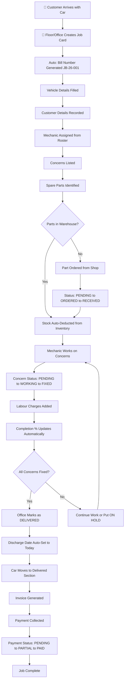

# 🔧 WorkshopOS (Titan) — OPERATIONAL BLUEPRINT
## How Every Feature Connects & Works Together

---

## 1. THE COMPLETE CAR SERVICE LIFECYCLE

### Step-by-Step Flow



---

## 2. WHO DOES WHAT — STAFF ROLE CONNECTIONS

```
 OWNER (Sahad/Rijas)
   Can do EVERYTHING below + these exclusive actions:
   - View and Restore Trash (deleted job cards)
   - Monitor all active login sessions
   - Remotely revoke any staff access
   - Receive security alerts (SMS + Telegram) on every login
   - Access Django Admin panel

 OFFICE STAFF
   Everything Floor can do + these actions:
   - View full Job Card List with search
   - Delete job cards (soft-delete to trash)
   - Mark cars as Delivered / Undo delivery
   - View and Generate Invoices
   - Update payment status and amounts
   - Process Bulk/Fleet Payments
   - View Pending Payments dashboard
   - Manage Master Lists (Brands, Models, Spares, Concerns)
   - View Car Profiles (vehicle history)
   - Create/Delete staff accounts
   - Add/Edit/Toggle mechanics
   - Run Data Cleanup (rename, merge, delete duplicates)
   - Manage Inventory categories and items

 FLOOR (Mechanics / Floor Manager)
   - View Dashboard (active cars on floor)
   - Create new Job Cards
   - Edit existing Job Cards (add concerns, spares, labour)
   - View Live Report (quick scroll of all jobs)
   - Use Autocomplete (search brands, models, spares, concerns)
   - View Inventory Restock page
   - Update stock levels
```

---

## 3. JOB CARD — THE CENTRAL HUB

Everything in the system connects through the Job Card:

```
                    MECHANIC
                    (Roster)
                       |
                  assigned to
                       |
 MASTER LISTS -----> JOB CARD -----> INVOICE
 (Brands,Models,      |                |
  Spares,Concerns)    |                |
     ^                |             PAYMENT
     | auto-learn     |             STATUS
     |                |
     |     +----------+----------+
     |     |          |          |
     |  CONCERNS    SPARES    LABOUR
     |  - Text      - Part     - Job Desc
     |  - Status:   - Qty      - Amount
     |   PENDING    - Shop $
     |   WORKING    - Cust $
     |   FIXED      - Status:
     |              PENDING
     |              ORDERED
     |              RECEIVED
     |                |
     |                | auto-sync
     |                v
     |          INVENTORY
     |          (Warehouse)
     |                |
     +------->  TOTAL BILL AMOUNT
           = Sum(Spare Prices)
           + Sum(Labour Amounts)
           Auto-calculated on every save
```

---

## 4. BILLING & FINANCIAL FLOW

### Cost Accumulation

```
Spare Part Added (Customer Price) --+
                                    +--> Total Bill Auto-Calculated --> Invoice
Labour Added (Amount) -------------+     (updates on every save)
```

### Payment States

```
PENDING  = Nothing received yet
PARTIAL  = Some money received, balance remains
PAID     = Full amount received (discount auto-calculated if received < bill)
```

### Spare Part Pricing (Two-Price System)

```
Shop Price (Unit Price)  = What YOU paid to the parts shop
Customer Price (Total)   = What the CUSTOMER pays (with your markup)
Profit per part = Customer Price - (Shop Price x Quantity)
```

### Bulk/Fleet Payment (Cascade Algorithm)

```
Customer "XYZ" has 5 unpaid jobs:

Job 1: Rs.3,000 balance (oldest)
Job 2: Rs.5,000 balance
Job 3: Rs.2,000 balance
Job 4: Rs.4,000 balance
Job 5: Rs.1,000 balance (newest)

Customer pays Rs.10,000 lump sum:

Job 1: Rs.3,000 paid  (remaining: Rs.7,000)
Job 2: Rs.5,000 paid  (remaining: Rs.2,000)
Job 3: Rs.2,000 paid  (remaining: Rs.0)
Job 4: Rs.0 -- funds exhausted
Job 5: Rs.0 -- funds exhausted

Result: 3 jobs fully paid, 2 still pending
```

---

## 5. INVENTORY <-> JOB CARD AUTO-SYNC

```
JOB CARD ACTION                      WAREHOUSE EFFECT
----------------------------------------------
Add "Oil Filter" x 2           -->   Oil Filter: 10 to 8  (auto -2)
Change qty to 5                -->   Oil Filter: 8 to 5   (auto -3 delta)
Change to "Air Filter"         -->   Oil Filter: 5 to 10  (auto +5 restore)
                               -->   Air Filter: 7 to 2   (auto -5 deduct)
Delete spare line              -->   Air Filter: 2 to 7   (auto +5 restore)
```

### Low Stock Alert System

```
Each item has:  Average Stock (ideal level)
                Current Stock (actual count)

Health = (Current / Average) x 100%

 Green  (50%+)   = Healthy stock
 Yellow (25-49%) = Warning, reorder soon
 Red    (below 25%) = Critical, order immediately
```

---

## 6. AUTOCOMPLETE — SMART LEARNING SYSTEM

```
MASTER LISTS (Knowledge Base)          JOB CARD FORM
----------------------------          ---------------
CarBrand: Toyota, BMW, Audi      <->  Brand field (autocomplete)
CarModel: Corolla, 3 Series      <->  Model field (autocomplete)
SparePart: Oil Filter, Brake     <->  Spare Part field (autocomplete)
ConcernSolution: Brake noise     <->  Concern field (autocomplete)
```

**AUTO-LEARN**: When you type a NEW spare part or concern that doesn't exist in the master list, the system AUTOMATICALLY adds it for future use.

**INVENTORY PRIORITY**: When searching spares, items found in the Warehouse show FIRST (highlighted), then master list items.

---

## 7. CAR PROFILE — VEHICLE HISTORY TRACKING

```
Registration: KL-07-AB-1234

Visit 1 (Jan 2025):  Oil change, Brake pad         Rs.4,500
Visit 2 (Apr 2025):  AC repair, Belt replacement    Rs.8,200
Visit 3 (Sep 2025):  Full service, Tire rotation     Rs.12,000
Visit 4 (Feb 2026):  Engine check, Battery           Rs.6,800
                                                --------
                                     Total:     Rs.31,500
                                     Visits:    4

One click: "New Visit" pre-fills all customer and vehicle details
```

---

## 8. SECURITY — COMPLETE PROTECTION CHAIN

```
SOMEONE TRIES TO LOGIN
        |
        v
 IP LOCKOUT CHECK
 5+ failed attempts within 15 min? --> BLOCKED
        |
        | Passed
        v
 AUTHENTICATE
 Username + Password (or Mobile + Password for Owners)
        |
        | Success
        v
 ROLE CHECK
 Staff portal blocks Owners (privacy)
 Owner portal blocks Staff (security)
        |
        | Correct portal
        v
 SESSION CREATED
 Track: Device, IP, Browser, Last Activity
 (updates on every request)
        |
        v
 SECURITY ALERT BROADCAST
 SMS to Owner 1 phone
 SMS to Owner 2 phone
 Telegram to Owner 1 chat
 Telegram to Owner 2 chat
 "[ALERT]: John logged in from Chrome on Samsung Galaxy, IP: 192.168.1.5"
```

### Forgot Password Flow

```
Owner enters username/mobile
  --> System looks up mobile from .env
  --> 6-digit OTP sent via SMS + Telegram
      (60-second cooldown, 5-minute expiry)
  --> Owner enters OTP + New Password
      (3 attempts max, then 5-min lockout)
  --> Password updated, redirect to login
```

### Owner Dashboard (anytime)

```
- See all active sessions (who is logged in, from what device)
- One click: REVOKE any session (logs them out instantly)
```

---

## 9. DATA CLEANUP — KEEPING THINGS CLEAN

```
PROBLEM: Over time, typos accumulate in master lists
         "Oil Filter", "oil filter", "Oil Filtr", "OIL FILTER"

CLEANUP TOOL:
  Spare: "Oil Filtr" (used in 3 job cards)
  [Rename to "Oil Filter"]  [Delete]
  --> Rename updates ALL 3 job cards too!
  --> If "Oil Filter" already exists: MERGE

Same for Concerns:
  "brake noise" + "Brake Noise" --> Merge into one
```

---

## 10. DASHBOARD — WHAT EACH SCREEN SHOWS

```
MAIN DASHBOARD (home)
  Shows: All ACTIVE cars currently on the floor
  Cards: Reg, Brand/Model, Color dot, Mechanic, Completion %
  Actions: Create Job, Mark Delivered, Toggle Hold

JOB LIST
  Shows: ALL job cards (active + delivered, not trash)
  Searchable, Paginated (21 per page), AJAX live search

LIVE REPORT
  Shows: Quick overview of all jobs for floor workers
  Minimal info, fast scroll, search + status filter

DELIVERED LIST
  Shows: Cars that have been picked up
  Filters: Today / Week / Month / Year / Custom range
  Actions: Undo delivery, View invoice

PENDING PAYMENTS
  Shows: All unpaid/partially paid jobs
  Displays: Total outstanding balance

BULK PAYMENTS
  Shows: Search by customer -> Grouped pending bills
  Action: Enter lump sum -> Auto-distribute oldest first

TRASH (Owner only)
  Shows: Soft-deleted job cards
  Action: Restore back to active floor

CAR PROFILES
  Shows: Unique vehicles grouped by registration
  Drill-down: Full visit history for any car

INVENTORY
  Restock: View all stock levels with health bars
  Manage: Add/edit categories and items
  Low Stock: Critical items needing reorder
  History: Who used what, when

MANAGEMENT DASHBOARD
  Accounts: Create/delete Office and Floor staff
  Mechanics: Add/rename/toggle active status
  Security: View all devices, revoke sessions
  Cleanup: Fix typos, merge duplicates in master lists
```

---

## 11. COMPLETE CONNECTION SUMMARY

```
                         CUSTOMER
                            |
               Brings car / Picks up car
                            |
                            v
  MASTER LISTS <--auto--> JOB CARD <-------> INVOICE
  (knowledge)    learn   (Hub of All)            |
       |                  |  |  |             PAYMENT
       v                  |  |  |            PROCESSING
  AUTOCOMPLETE     +------+  |  +------+    - Single
  API              |         |         |    - Bulk
                   v         v         v    - Cascade
              CONCERNS    SPARES    LABOUR
              (tracking) (parts)   (work)
                            |
                       auto-sync
                            v
                       INVENTORY
                      (Warehouse)
                      - Stock levels
                      - Low alerts
                      - Usage history

  STAFF ACCOUNTS  -------->  SECURITY SYSTEM
  - Owner (2)                - IP Lockout
  - Office (1)               - Session Monitor
  - Floor (many)             - SMS/Telegram Alerts
  - Mechanics (6)            - Remote Revoke
                             - OTP Reset

  CAR PROFILES
  Full vehicle history from all job cards
```

---

> **In one sentence**: Customer arrives -> Job card created -> Concerns/Spares/Labour tracked -> Inventory auto-syncs -> Car delivered -> Invoice generated -> Payment collected -> Everything searchable forever through Car Profiles.
